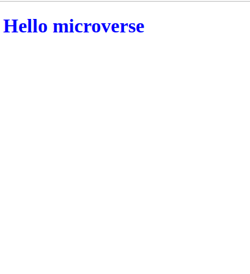

# My portfolio mobile version

> One paragraph statement about the project.

Additional description about the project and its features.
### This is a simple say hello web Site
 - I added the Hmtl, csll and linters.
 - I parsed the figma design to get the design data.
 - Then added test.md and node_modules, to the .gitignore file

## Built With

- Html
- Css
- Linters

## Getting Started

To set up locally on your machine `Git pull` then open the file on your browser.

👤 **Author1**

- GitHub: [@githubhandle](https://github.com/gabrielcoder247)
- LinkedIn: [LinkedIn](https://www.linkedin.com/in/gabriel-nwachukwu-209613173/)

## 🤝 Contributing

Contributions, issues, and feature requests are welcome!

## Show your support

Give a ⭐️ if you like this project!

## Acknowledgments

- Hat tip to anyone whose code was used
- Inspiration
- etc

## 📝 License

This project is [MIT](MIT.md) licensed.
